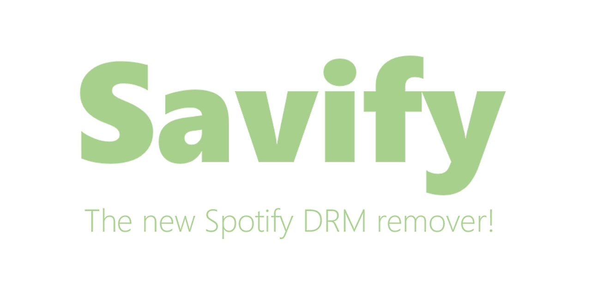

    

# About
[Savify](https://l4rry2k.github.io/savify/) is a desktop application that converts and downloads songs from Spotify, YouTube, Soundcloud, Deezer and many other sites. Converting songs to MP3 with quality as high as **320 kb/s**! The application will also scrape and apply **id3V2 tags** to all of your songs. Tags include **title, artist, genre, year, album and even cover-art!**

Savify supports Spotify, YouTube, Soundcloud and Deezer playlists, with an added **integrated search engine** function so if you don't have the link you can simply search for the song name and artist and Savify will download it!

As well as MP3, Savify can also download and convert to other file types. Inside the application, you can specify which format and quality you would like to download the song in for maximum compatibility across all of your devices. Available formats: MP3, AAC, FLAC, M4A, OPUS, VORBIS, and WAV. **NOTE: Tags and cover-art will only be applied to songs downloaded in MP3 format.**

## Donate: 

# Download for Windows
Download the latest release of Savify for Windows here: https://l4rry2k.github.io/savify/
## Windows Warning
Running antivirus on your PC may interfere with Savify.
To solve this please add an exception for Savify in your antivirus firewall.

# Spotify Authentication
Savify is a legitimate app that integrates with **Spotify Api**, this means if you would like to convert an accepted Spotify link Savify will ask you to login with your Spotify account. This process uses [oAuth](https://oauth.net/) and is 100% secure. Savify respects the privacy of its users and only collects the necessary data to convert your song.

# For Developers
## Installation
Install and download the following:
- Visual Studio Community 2015 or later
- Download [Ffmpeg (Static)](https://ffmpeg.zeranoe.com/builds/) and [Youtube-dl](https://ytdl-org.github.io/youtube-dl/download.html)
- Extract and place these binaries in the 'bin' folder for each project
- Alternatively you can get these binaries by downloading the latest release

## Running the app
### GUI App
#### With Executable
**Coming Soon!**
#### From Commandline
**Coming Soon!**

### Console App
#### With Executable
- Clone repo and build the solution with Visual Studio
- Go to 'Savify.Console/bin/Debug/'
- Run 'Savify.Console.exe'
#### From Commandline
**Coming Soon!**

## Building the app
Inside Visual Studio right-click on the solution and select 'Build Solution', or use the keyboard shortcut 'Ctrl+Shift+B'

# Credits
|Library|Author(s)|Project Link|Description|
|---|---|---|---|
|MetaBrainz.MusicBrainz|Zastai|[GitHub](https://github.com/Zastai/MusicBrainz)|This package provides classes for accessing the MusicBrainz web services (lookup, search and OAuth2).|
|MetaBrainz.MusicBrainz.CoverArt|Zastai|[GitHub](https://github.com/Zastai/MusicBrainz)|This package provides classes for accessing the CoverArt Archive (CAA), enabling the retrieval of cover art for music releases based on their MusicBrainz ID.|
|Newtonsoft.Json|James Newton-King|[Website](https://www.newtonsoft.com/json)|Json.NET is a popular high-performance JSON framework for .NET.|
|TagLibSharp|Brian Nickel, Gabriel Burt, Stephen Shaw, etc|[GitHub](https://github.com/mono/taglib-sharp)|A library for for reading and writing metadata in media files, including video, audio, and photo formats.|
